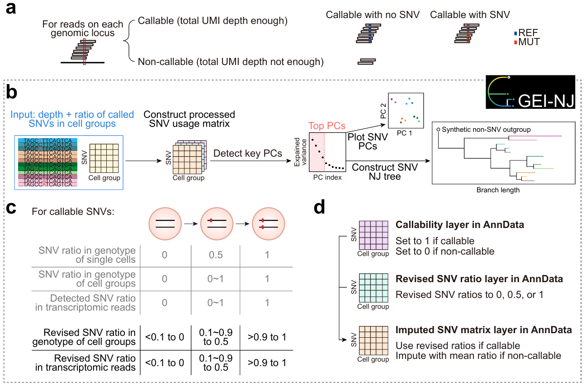

# GEI-NJ

## GEI-NJ: gene expression informed neighbor-joining tree construction for cell lineage inference from single-cell and spatial transcriptomic sequencing profiles

<div align="center">
    
</div>

GEI-NJ provides functions for processing SNV ratio/depth `AnnData` objects, plotting PCA projections, and constructing neighbor-joining trees from PCA-derived features.

**Note:** GEI-NJ does not perform SNV calling. If SNV calling is required, please first use [LineMut Call](https://github.com/RuiyingChenBioinfo/LineMut) or other suitable SNV-calling workflows to generate SNV ratio and depth `AnnData` inputs for GEI-NJ.

## Requirements

Python 3.9+

Required Python packages:

- anndata
- biopython
- matplotlib
- numpy
- pandas
- scipy

## Installation

```bash
pip install git+https://github.com/RuiyingChenBioinfo/GEI-NJ.git
```


## Usage

GEI-NJ takes matched SNV ratio and sequencing depth `AnnData` objects as input. The SNV ratio object should contain unit-by-SNV mutation ratios in `adata.X`, and the depth object should contain the corresponding unit-by-SNV sequencing depths with matched observation and variable names.

A complete example is provided in the [tutorial](./assets/Tutorial_GEI_NJ.html). Function-level usage and parameter descriptions are provided in the [API reference](./assets/API.html).

### Basic workflow

```python
import anndata as ad
import scanpy as sc

from gei_nj import (
    add_callable_layer,
    build_and_plot_nj,
    comb_depth_ratio,
    filt_snv_by_depth_ratio,
    impute_non_callable_by_snv_mean,
    plot_snv_pca_by_group,
    revise_snv_ratio,
)

# Load matched SNV depth and ratio matrices
ad_depth = ad.read_h5ad("unit_depth.h5ad")
ad_ratio = ad.read_h5ad("unit_ratio.h5ad")

# Combine depth and ratio matrices into one AnnData object
# The SNV ratio matrix is stored in adata.X
# The sequencing depth matrix is stored in adata.layers["depth"]
adata = comb_depth_ratio(ad_depth, ad_ratio)

# Filter SNVs based on sequencing depth and mutation support
adata = filt_snv_by_depth_ratio(
    adata,
    min_tot_depth=20,
    min_mut_depth=5,
    min_mut_avg_ratio=0.1,
)

# Add a binary callability layer
# Each entry is considered callable if its depth is no less than min_callable_depth
adata = add_callable_layer(
    adata,
    min_callable_depth=3,
    depth_layer="depth",
    callable_layer="callable",
)

# Revise continuous SNV ratios into discrete SNV states
# By default, the original ratio matrix is stored in adata.layers["original_ratio"]
adata = revise_snv_ratio(
    adata,
    layer_name="original_ratio",
    low=0.1,
    high=0.9,
    mid=0.5,
)

# Impute non-callable entries using the per-SNV mean from callable entries
# The imputed matrix is stored in adata.layers["geinj_state_imputed"]
# and adata.X is updated to the imputed matrix
adata = impute_non_callable_by_snv_mean(
    adata,
    callable_layer="callable",
    output_layer="geinj_state_imputed",
)

# Run PCA before plotting PCA projections or constructing NJ trees
# This example uses scanpy for PCA
n_comps = min(adata.n_obs - 1, adata.n_vars, 50)
sc.pp.pca(adata, n_comps=n_comps)

# Visualize SNV PCA projection
plot_snv_pca_by_group(
    adata,
    pcx=1,
    pcy=2,
    group_by="group",
)

# Construct and plot a GEI-NJ tree
# K_tree specifies the number of top PCs used for NJ tree construction
tree = build_and_plot_nj(
    adata,
    group_key="group",
    K_tree=2,
)
```

### Optional: leave-one-out assessment for tree stability

GEI-NJ also supports leave-one-out (LOO) assessment over selected PCs. When `pc_loo=True`, replicate NJ trees are generated by excluding one PC at a time from the first `K_pc_loo` PCs. Internal split support values can be displayed on the reference tree.

```python
tree = build_and_plot_nj(
    adata,
    group_key="group",
    K_tree=2,
    pc_loo=True,
    K_pc_loo=4,
    pc_loo_min_support=25,
    show_leaf_labels=True,
)
```

### Main outputs

After preprocessing, the processed `AnnData` object contains several GEI-NJ related matrices:

```text
adata.X
    The current matrix used for PCA and NJ tree construction.

adata.layers["depth"]
    Sequencing depth matrix.

adata.layers["callable"]
    Binary callability matrix.

adata.layers["original_ratio"]
    Original SNV ratio matrix before ratio revision.

adata.layers["geinj_state_imputed"]
    Imputed SNV matrix generated by GEI-NJ.
```

## Citations

A formal citation will be added here upon publication.

## Contact

* Ruiying Chen (陈睿颖), <chenruiying@genomics.cn>
* Chao Qin (秦超), <qinchao@genomics.cn>
* Hai-Xi Sun (孙海汐), <sunhaixi@genomics.cn>
